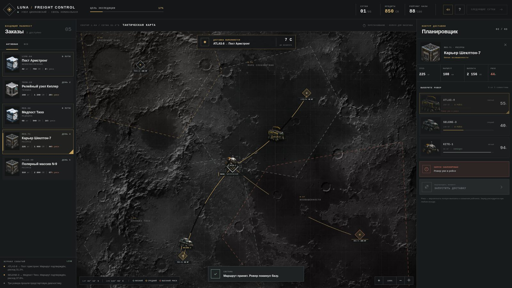
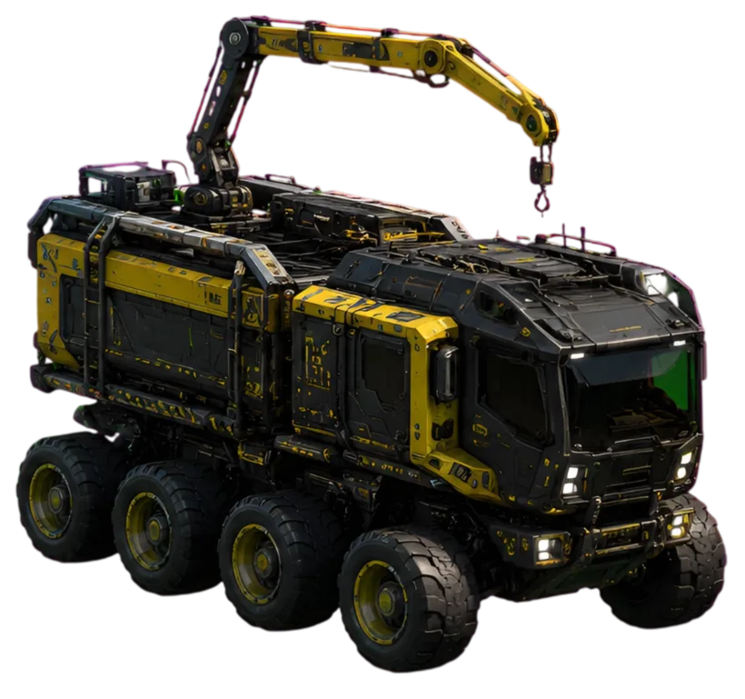
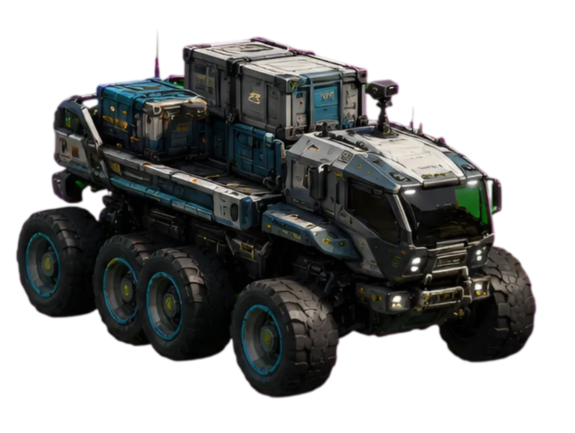
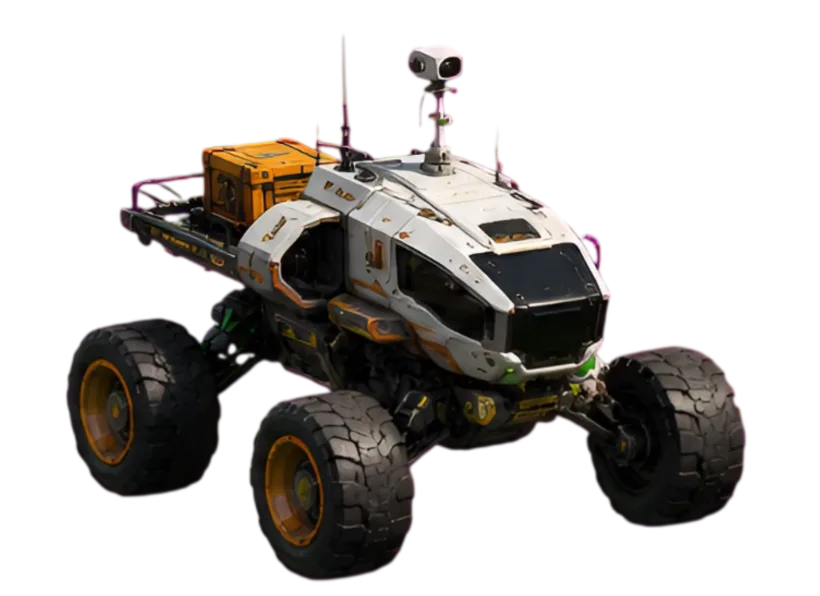
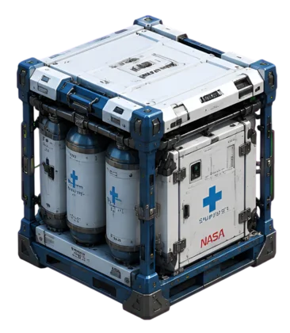
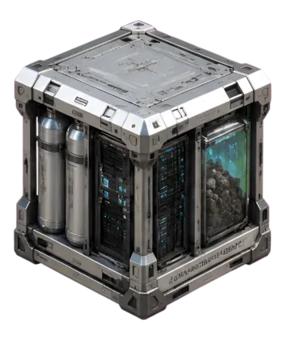
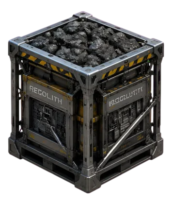

# Lunar Logistics

Игровой симулятор лунной логистики. Игрок — диспетчер базы Циолковский: выбирает заказы, назначает роверы, оценивает массу груза, заряд батареи, сложность рельефа и риск маршрута. Цель — за 5 лунных суток накопить ≥ 5 000 CR и не потерять рейтинг базы.

Главный объект — интерактивная карта Луны: все решения принимаются выбором точки, ровера и маршрута.



---

## Соответствие техническому заданию

| Требование ТЗ | Реализация |
|---|---|
| Экран с картой Луны | Интерактивная карта 1600×1600 на основе сгенерированной поверхности, pan/zoom, pinch-zoom |
| Точки заказов на карте | Маркеры заказов с радиусом зоны риска и подписью |
| Заказы с весом, наградой, срочностью и риском | 5 заказов: вес (кг), награда (CR), дедлайн (день), риск (0–100) |
| Роверы с батареей, грузоподъёмностью, статусом | 3 ровера: ATLAS-8 / SELENE-3 / KITE-1, статусы idle/enroute |
| Выбор заказа и ровера, запуск доставки | Клик по заказу → выбор ровера → кнопка «Запустить» → `POST /api/dispatch` |
| Хранение в базе | SQLite: `game_state`, `rovers`, `orders`, `deliveries`, `events` |
| Тяжёлый заказ влияет на доставку | Вес входит в расход батареи и длительность |
| Проверка батареи и грузоподъёмности | Сервер отклоняет недопустимые маршруты с пояснением |
| Разные зоны отличаются по риску/скорости | У каждого заказа свой `risk` и `speedFactor` |
| Хотя бы один невозможный сценарий | `POLAR-99` (310 кг) — ни один ровер не может его везти |
| Очки/деньги/батарея/статус меняются после доставки | `reconcile` начисляет награду, штраф, восстанавливает ровер |
| Цель игры | 5 000 CR за 5 суток; рейтинг базы падает за просрочку и провалы |

---

## Запуск

Нужен только Go 1.25+ ([установка](https://go.dev/doc/install)).

Запустить можно из исходников или скачать готовый бинарник под свою ОС в [Releases](https://github.com/notyado/lunar-logistic/releases).

```bash
git clone https://github.com/notyado/lunar-logistic.git
cd lunar-logistics
go run .
```

Открыть `http://localhost:8080`.

Переменные окружения:

| Переменная | По умолчанию | Назначение |
|---|---|---|
| `ADDR` | `:8080` | адрес HTTP-сервера |
| `DB_PATH` | `data/luna.db` | путь к SQLite |

---

## Логика веса, риска и доставки

Проверки продублированы на клиенте, чтобы ошибки были видны сразу, но финальное решение всегда принимает сервер.

### 1. Грузоподъёмность

Ровер не может взять заказ тяжелее своей `capacity`. Например, `POLAR-99` весит 310 кг, а максимум у `ATLAS-8` — 260 кг → маршрут блокируется.

### 2. Расход батареи

```
cost = (distance × 0.45 + weight × 0.06) / efficiency + risk × 0.08
cost = ceil(cost × 10) / 10
```

Дальность и вес съедают заряд, `efficiency` ровера снижает расход, риск добавляет overhead. Если `rover.battery < batteryCost` — запуск отклоняется.

### 3. Длительность доставки

```
routeFactor = max(0.45, speedFactor)   // сложность рельефа зоны
seconds = 5 + distance / (speed × routeFactor × 20) + weight / 95 + risk / 35
duration = max(7, ceil(seconds))
```

Тяжёлый груз и сложный рельеф замедляют ровера.

### 4. Риск доставки

При завершении считается детерминированный бросок:

```
roll = (delivery.id × 37 + order.id × 19 + day × 23) mod 100
success = roll >= order.risk
```

**Успех:** заказ → `delivered`, зачисляется `reward` (+10 % бонус за досрочную доставку), рейтинг +2.
**Провал:** заказ → `failed`, награда 0, рейтинг −`max(4, risk/8)`, очки −180.

### 5. Переход суток

`POST /api/next-day` запрещён, пока есть активные (`enroute`) доставки. При переходе:

- заказы с прошедшим дедлайном → `expired`, рейтинг −3 за каждый;
- роверы заряжаются на +28 % и возвращаются на базу;
- на 5-й день экспедиция завершается (`finished = true`).

---

## Данные и хранение

SQLite в WAL-режиме, с foreign keys. База создаётся автоматически в `data/luna.db`.

| Таблица | Назначение |
|---|---|
| `game_state` | День, кредиты, очки, рейтинг, цель, счётчик запусков, флаг завершения |
| `rovers` | 3 ровера: slug, класс, батарея, грузоподъёмность, статус, позиция, efficiency, speed |
| `orders` | 5 заказов: код, категория, вес, награда, дедлайн, риск, зона, координаты, статусы |
| `deliveries` | История доставок: order, rover, статус, время старта/завершения, расход батареи, результат |
| `events` | Лента событий (launch/success/failure/day/system) — последние 8 отдаются клиенту |

Каждая игровая операция (запуск, завершение, переход суток) выполняется в одной SQL-транзакции. `reconcile` вызывается перед каждым ответом — отдельного фонового процесса не нужно.

---

## Роверы

Изображения сгенерированы через ChatGPT (DALL·E).

| Ровер | Класс | Изображение | Батарея | Грузоподъёмность | Эффективность | Скорость |
|---|---|---|---|---|---|---|
| **ATLAS-8** | Тяжёлый |  | 86 % | 260 кг | 0.88 | 0.78 |
| **SELENE-3** | Средний |  | 78 % | 140 кг | 1.00 | 0.96 |
| **KITE-1** | Лёгкий |  | 94 % | 55 кг | 0.76 | 1.18 |

- **ATLAS-8** — тяжёлый 8-колёсный вездеход с грузовым краном. Везёт много, но медленный и прожорливый.
- **SELENE-3** — сбалансированный средний ровер, лучший по efficiency.
- **KITE-1** — лёгкий скоростной ровер для близких и нетяжёлых маршрутов, но малая грузоподъёмность.

## Заказы

Изображения контейнеров сгенерированы через ChatGPT (DALL·E).

| Код | Название | Категория | Контейнер | Вес | Награда | Дедлайн | Риск | Особенность |
|---|---|---|---|---|---|---|---|---|
| **LIFE-04** | Пост Армстронг | Жизнеобеспечение |  | 42 кг | 760 CR | день 1 | 8 | Близкий лёгкий заказ |
| **TECH-19** | Релейный узел Кеплер | Техника |  | 108 кг | 1240 CR | день 2 | 26 | Средний технический груз |
| **REG-71** | Карьер Шеклтон-7 | Ресурсы |  | 225 кг | 1960 CR | день 4 | 44 | Тяжёлый, только ATLAS-8 |
| **MED-08** | Медпост Тихо | Медицина |  | 68 кг | 940 CR | день 3 | 16 | Дальний, средний риск |
| **POLAR-99** | Полярный массив N-9 | Ресурсы |  | 310 кг | 2800 CR | день 5 | 67 | **Невозможен**: 310 кг > 260 кг max |

`POLAR-99` — намеренно недоставимый заказ: монолитный реакторный блок, который ни один ровер не может увезти. Демонстрирует блокировку по грузоподъёмности.

---

## Стек и AI

| Слой | Технология |
|---|---|
| Backend | Go 1.25+ |
| База данных | SQLite |
| Frontend | Vue 3 (ESM production build) |
| Карта | Собственная реализация на CSS-transform |

**Что использовано из AI:**

- **ChatGPT** — генерация изображений роверов (ATLAS-8, SELENE-3, KITE-1) и контейнеров (life, tech, resources), а также базовой текстуры лунной поверхности.
- **Cursor** — помощь в проектировании архитектуры, код-ревью и фронтенд.

---

## Архитектура

```
lunar-logistics/
├── main.go                      # точка входа: конфиг, сборка зависимостей, запуск сервера
├── internal/
│   ├── model/model.go           # доменные типы (Game, Rover, Order, Delivery, Event, State)
│   ├── store/
│   │   ├── store.go             # SQLite: Open, Reset, Get*, Snapshot
│   │   └── seed.go              # схема БД и начальные данные
│   ├── game/game.go             # бизнес-логика: формулы, Dispatch, NextDay, Reconcile
│   └── server/server.go         # HTTP-обработчики, роутер, middleware, JSON-хелперы
├── data/                        # luna.db создаётся автоматически
├── static/                      # фронтенд: index.html, app.js, styles.css, assets/, sounds/
└── docs/screenshot.jpg
```

---

## HTTP API

| Метод | Путь | Назначение |
|---|---|---|
| `GET` | `/api/state` | Полное состояние игры |
| `POST` | `/api/dispatch` | Запуск доставки: тело `{"orderId":1,"roverId":3}` → `202` + новое состояние |
| `POST` | `/api/next-day` | Переход к следующим суткам или завершение экспедиции |
| `POST` | `/api/reset` | Сброс игры к начальным данным |
| `GET` | `/api/health` | `{"status":"operational"}` |

Перед каждым ответом сервер завершает просроченные доставки и обновляет статусы.

Ошибки возвращаются как `{"error":"сообщение"}` с кодом `400` (плохой запрос), `404` (не найдено) или `422` (бизнес-нарушение: занятый ровер, мало батареи, превышена грузоподъёмность и т. п.).
